```python
print ('Ciao')
import matplotlib.pyplot as plt
import time
#import pytimber
import numpy as np
from bisect import bisect_left
from scipy import optimize
from numpy import asarray
from math import *

from scipy.optimize import fmin

%matplotlib inline 
#notebook or inline 

doAddReverse = True
```

    Ciao


```python
halfcellmin = 0.
halfcellmax = 5345. #5345.
filenum = ["1903","","01","02","03"]
quantity = ["TID","HEH","ThNeutrons","1MeVneq"]
inputname = dict()
inputname["TID"] = "DoseMB"
inputname["HEH"] = "HEHADEQ"
inputname["ThNeutrons"] = "THNEUT"
inputname["1MeVneq"] = "Si1MeV"
xmin=dict()
xmax=dict()
dose=dict()
fluence=dict()
radiation_all=dict()
radiation_cut=dict()
filename=dict()
mylabel=dict()

mylabel["1903"]="Q"
mylabel[""]="BA"
mylabel["01"]="BB"
mylabel["02"]="BC"
mylabel["03"]="Q"

deltas = 1.27e+04
sigma = 3.84e-26
fp = 2.00e+08
ff = 1.12e+04
fdoseHEH = dict()
fdoseHEH["TID"] = 1.60e-07
fdoseHEH["HEH"] = 1.
fdoseHEH["ThNeutrons"] = 1.
fdoseHEH["1MeVneq"] = 1.
extrafactor=2.
if doAddReverse==True :
    extrafactor=1.

for f in filenum :
    xmin[f] = dict()
    xmax[f] = dict()
    radiation_all[f] = dict()
    radiation_cut[f] = dict()
    filename[f] = dict()
    for q in quantity :
        xmin[f][q] = []
        xmax[f][q] = []
        radiation_all[f][q] = []
        radiation_cut[f][q] = []
        filename[f][q] = inputname[q]+f+".dat"
        print ('Working on' , filename[f][q])
        infile = open(filename[f][q],'r')
        for line in infile :
            myl = line.replace('\n','')
            if '#' in myl :
                continue
            if len(myl.strip())==0 :
                break
            l = myl.split(' ')
            #print (myl)
            #print (halfcell , int(l[1]))
            xmin[f][q].append(int(l[0]))
            xmax[f][q].append(int(l[1]))
            radiation_all[f][q].append(float(l[2])*deltas*sigma*fp*ff*fdoseHEH[q]*extrafactor)
        #print ('X min: ' , xmin[f])
        #print ('X max: ' , xmax[f])
        #print ('Radiation: ' , radiation[f])

```

    Working on DoseMB1903.dat
    Working on HEHADEQ1903.dat
    Working on THNEUT1903.dat
    Working on Si1MeV1903.dat
    Working on DoseMB.dat
    Working on HEHADEQ.dat
    Working on THNEUT.dat
    Working on Si1MeV.dat
    Working on DoseMB01.dat
    Working on HEHADEQ01.dat
    Working on THNEUT01.dat
    Working on Si1MeV01.dat
    Working on DoseMB02.dat
    Working on HEHADEQ02.dat
    Working on THNEUT02.dat
    Working on Si1MeV02.dat
    Working on DoseMB03.dat
    Working on HEHADEQ03.dat
    Working on THNEUT03.dat
    Working on Si1MeV03.dat


```python
offset=dict()
offset["1903"] = 0 
offset[""] = 280 + 830 
offset["01"] = 280 + (830*3)-90 
offset["02"] = 280 + (830*5)-175 
offset["03"] = 280 + (830*6)+100 

xprime=dict()

for f in filenum :
    xprime[f]=dict()
    for q in quantity :
        xprime[f][q]=[]
        for i in range(0,len(xmin[f][q])) :
            m_xmin = xmin[f][q][i] + offset[f]
            m_xmax = xmax[f][q][i] + offset[f]
            if ((float(m_xmin+m_xmax)/2) < (halfcellmax)) and ((float(m_xmin+m_xmax)/2) > (halfcellmin)) :
                xprime[f][q].append(float(m_xmin+m_xmax)/2) 
                radiation_cut[f][q].append(radiation_all[f][q][i])
        print ('Working on' , filename[f][q])
        print ('X prime: ' , xprime[f][q])
        

```

    Working on DoseMB1903.dat
    X prime:  [10.0, 30.0, 50.0, 70.0, 90.0, 110.0, 130.0, 150.0, 170.0, 190.0, 210.0, 230.0, 250.0, 270.0, 290.0, 310.0, 330.0, 350.0, 370.0, 390.0, 410.0, 430.0]
    Working on HEHADEQ1903.dat
    X prime:  [10.0, 30.0, 50.0, 70.0, 90.0, 110.0, 130.0, 150.0, 170.0, 190.0, 210.0, 230.0, 250.0, 270.0, 290.0, 310.0, 330.0, 350.0, 370.0, 390.0, 410.0, 430.0]
    Working on THNEUT1903.dat
    X prime:  [10.0, 30.0, 50.0, 70.0, 90.0, 110.0, 130.0, 150.0, 170.0, 190.0, 210.0, 230.0, 250.0, 270.0, 290.0, 310.0, 330.0, 350.0, 370.0, 390.0, 410.0, 430.0]
    Working on Si1MeV1903.dat
    X prime:  [10.0, 30.0, 50.0, 70.0, 90.0, 110.0, 130.0, 150.0, 170.0, 190.0, 210.0, 230.0, 250.0, 270.0, 290.0, 310.0, 330.0, 350.0, 370.0, 390.0, 410.0, 430.0]
    Working on DoseMB.dat
    X prime:  [290.0, 310.0, 330.0, 350.0, 370.0, 390.0, 410.0, 430.0, 450.0, 470.0, 490.0, 510.0, 530.0, 550.0, 570.0, 590.0, 610.0, 630.0, 650.0, 670.0, 690.0, 710.0, 730.0, 750.0, 770.0, 790.0, 810.0, 830.0, 850.0, 870.0, 890.0, 910.0, 930.0, 950.0, 970.0, 990.0, 1010.0, 1030.0, 1050.0, 1070.0, 1090.0, 1110.0, 1130.0, 1150.0, 1170.0, 1190.0, 1210.0, 1230.0, 1250.0, 1270.0, 1290.0, 1310.0, 1330.0, 1350.0, 1370.0, 1390.0, 1410.0, 1430.0, 1450.0, 1470.0, 1490.0, 1510.0, 1530.0, 1550.0, 1570.0, 1590.0, 1610.0, 1630.0, 1650.0, 1670.0, 1690.0, 1710.0, 1730.0, 1750.0, 1770.0, 1790.0, 1810.0, 1830.0, 1850.0, 1870.0, 1890.0, 1910.0, 1930.0]
    Working on HEHADEQ.dat
    X prime:  [290.0, 310.0, 330.0, 350.0, 370.0, 390.0, 410.0, 430.0, 450.0, 470.0, 490.0, 510.0, 530.0, 550.0, 570.0, 590.0, 610.0, 630.0, 650.0, 670.0, 690.0, 710.0, 730.0, 750.0, 770.0, 790.0, 810.0, 830.0, 850.0, 870.0, 890.0, 910.0, 930.0, 950.0, 970.0, 990.0, 1010.0, 1030.0, 1050.0, 1070.0, 1090.0, 1110.0, 1130.0, 1150.0, 1170.0, 1190.0, 1210.0, 1230.0, 1250.0, 1270.0, 1290.0, 1310.0, 1330.0, 1350.0, 1370.0, 1390.0, 1410.0, 1430.0, 1450.0, 1470.0, 1490.0, 1510.0, 1530.0, 1550.0, 1570.0, 1590.0, 1610.0, 1630.0, 1650.0, 1670.0, 1690.0, 1710.0, 1730.0, 1750.0, 1770.0, 1790.0, 1810.0, 1830.0, 1850.0, 1870.0, 1890.0, 1910.0, 1930.0]
    Working on THNEUT.dat
    X prime:  [290.0, 310.0, 330.0, 350.0, 370.0, 390.0, 410.0, 430.0, 450.0, 470.0, 490.0, 510.0, 530.0, 550.0, 570.0, 590.0, 610.0, 630.0, 650.0, 670.0, 690.0, 710.0, 730.0, 750.0, 770.0, 790.0, 810.0, 830.0, 850.0, 870.0, 890.0, 910.0, 930.0, 950.0, 970.0, 990.0, 1010.0, 1030.0, 1050.0, 1070.0, 1090.0, 1110.0, 1130.0, 1150.0, 1170.0, 1190.0, 1210.0, 1230.0, 1250.0, 1270.0, 1290.0, 1310.0, 1330.0, 1350.0, 1370.0, 1390.0, 1410.0, 1430.0, 1450.0, 1470.0, 1490.0, 1510.0, 1530.0, 1550.0, 1570.0, 1590.0, 1610.0, 1630.0, 1650.0, 1670.0, 1690.0, 1710.0, 1730.0, 1750.0, 1770.0, 1790.0, 1810.0, 1830.0, 1850.0, 1870.0, 1890.0, 1910.0, 1930.0]
    Working on Si1MeV.dat
    X prime:  [290.0, 310.0, 330.0, 350.0, 370.0, 390.0, 410.0, 430.0, 450.0, 470.0, 490.0, 510.0, 530.0, 550.0, 570.0, 590.0, 610.0, 630.0, 650.0, 670.0, 690.0, 710.0, 730.0, 750.0, 770.0, 790.0, 810.0, 830.0, 850.0, 870.0, 890.0, 910.0, 930.0, 950.0, 970.0, 990.0, 1010.0, 1030.0, 1050.0, 1070.0, 1090.0, 1110.0, 1130.0, 1150.0, 1170.0, 1190.0, 1210.0, 1230.0, 1250.0, 1270.0, 1290.0, 1310.0, 1330.0, 1350.0, 1370.0, 1390.0, 1410.0, 1430.0, 1450.0, 1470.0, 1490.0, 1510.0, 1530.0, 1550.0, 1570.0, 1590.0, 1610.0, 1630.0, 1650.0, 1670.0, 1690.0, 1710.0, 1730.0, 1750.0, 1770.0, 1790.0, 1810.0, 1830.0, 1850.0, 1870.0, 1890.0, 1910.0, 1930.0]
    Working on DoseMB01.dat
    X prime:  [1860.0, 1880.0, 1900.0, 1920.0, 1940.0, 1960.0, 1980.0, 2000.0, 2020.0, 2040.0, 2060.0, 2080.0, 2100.0, 2120.0, 2140.0, 2160.0, 2180.0, 2200.0, 2220.0, 2240.0, 2260.0, 2280.0, 2300.0, 2320.0, 2340.0, 2360.0, 2380.0, 2400.0, 2420.0, 2440.0, 2460.0, 2480.0, 2500.0, 2520.0, 2540.0, 2560.0, 2580.0, 2600.0, 2620.0, 2640.0, 2660.0, 2680.0, 2700.0, 2720.0, 2740.0, 2760.0, 2780.0, 2800.0, 2820.0, 2840.0, 2860.0, 2880.0, 2900.0, 2920.0, 2940.0, 2960.0, 2980.0, 3000.0, 3020.0, 3040.0, 3060.0, 3080.0, 3100.0, 3120.0, 3140.0, 3160.0, 3180.0, 3200.0, 3220.0, 3240.0, 3260.0, 3280.0, 3300.0, 3320.0, 3340.0, 3360.0, 3380.0, 3400.0, 3420.0, 3440.0, 3460.0, 3480.0, 3500.0]
    Working on HEHADEQ01.dat
    X prime:  [1860.0, 1880.0, 1900.0, 1920.0, 1940.0, 1960.0, 1980.0, 2000.0, 2020.0, 2040.0, 2060.0, 2080.0, 2100.0, 2120.0, 2140.0, 2160.0, 2180.0, 2200.0, 2220.0, 2240.0, 2260.0, 2280.0, 2300.0, 2320.0, 2340.0, 2360.0, 2380.0, 2400.0, 2420.0, 2440.0, 2460.0, 2480.0, 2500.0, 2520.0, 2540.0, 2560.0, 2580.0, 2600.0, 2620.0, 2640.0, 2660.0, 2680.0, 2700.0, 2720.0, 2740.0, 2760.0, 2780.0, 2800.0, 2820.0, 2840.0, 2860.0, 2880.0, 2900.0, 2920.0, 2940.0, 2960.0, 2980.0, 3000.0, 3020.0, 3040.0, 3060.0, 3080.0, 3100.0, 3120.0, 3140.0, 3160.0, 3180.0, 3200.0, 3220.0, 3240.0, 3260.0, 3280.0, 3300.0, 3320.0, 3340.0, 3360.0, 3380.0, 3400.0, 3420.0, 3440.0, 3460.0, 3480.0, 3500.0]
    Working on THNEUT01.dat
    X prime:  [1860.0, 1880.0, 1900.0, 1920.0, 1940.0, 1960.0, 1980.0, 2000.0, 2020.0, 2040.0, 2060.0, 2080.0, 2100.0, 2120.0, 2140.0, 2160.0, 2180.0, 2200.0, 2220.0, 2240.0, 2260.0, 2280.0, 2300.0, 2320.0, 2340.0, 2360.0, 2380.0, 2400.0, 2420.0, 2440.0, 2460.0, 2480.0, 2500.0, 2520.0, 2540.0, 2560.0, 2580.0, 2600.0, 2620.0, 2640.0, 2660.0, 2680.0, 2700.0, 2720.0, 2740.0, 2760.0, 2780.0, 2800.0, 2820.0, 2840.0, 2860.0, 2880.0, 2900.0, 2920.0, 2940.0, 2960.0, 2980.0, 3000.0, 3020.0, 3040.0, 3060.0, 3080.0, 3100.0, 3120.0, 3140.0, 3160.0, 3180.0, 3200.0, 3220.0, 3240.0, 3260.0, 3280.0, 3300.0, 3320.0, 3340.0, 3360.0, 3380.0, 3400.0, 3420.0, 3440.0, 3460.0, 3480.0, 3500.0]
    Working on Si1MeV01.dat
    X prime:  [1860.0, 1880.0, 1900.0, 1920.0, 1940.0, 1960.0, 1980.0, 2000.0, 2020.0, 2040.0, 2060.0, 2080.0, 2100.0, 2120.0, 2140.0, 2160.0, 2180.0, 2200.0, 2220.0, 2240.0, 2260.0, 2280.0, 2300.0, 2320.0, 2340.0, 2360.0, 2380.0, 2400.0, 2420.0, 2440.0, 2460.0, 2480.0, 2500.0, 2520.0, 2540.0, 2560.0, 2580.0, 2600.0, 2620.0, 2640.0, 2660.0, 2680.0, 2700.0, 2720.0, 2740.0, 2760.0, 2780.0, 2800.0, 2820.0, 2840.0, 2860.0, 2880.0, 2900.0, 2920.0, 2940.0, 2960.0, 2980.0, 3000.0, 3020.0, 3040.0, 3060.0, 3080.0, 3100.0, 3120.0, 3140.0, 3160.0, 3180.0, 3200.0, 3220.0, 3240.0, 3260.0, 3280.0, 3300.0, 3320.0, 3340.0, 3360.0, 3380.0, 3400.0, 3420.0, 3440.0, 3460.0, 3480.0, 3500.0]
    Working on DoseMB02.dat
    X prime:  [3435.0, 3455.0, 3475.0, 3495.0, 3515.0, 3535.0, 3555.0, 3575.0, 3595.0, 3615.0, 3635.0, 3655.0, 3675.0, 3695.0, 3715.0, 3735.0, 3755.0, 3775.0, 3795.0, 3815.0, 3835.0, 3855.0, 3875.0, 3895.0, 3915.0, 3935.0, 3955.0, 3975.0, 3995.0, 4015.0, 4035.0, 4055.0, 4075.0, 4095.0, 4115.0, 4135.0, 4155.0, 4175.0, 4195.0, 4215.0, 4235.0, 4255.0, 4275.0, 4295.0, 4315.0, 4335.0, 4355.0, 4375.0, 4395.0, 4415.0, 4435.0, 4455.0, 4475.0, 4495.0, 4515.0, 4535.0, 4555.0, 4575.0, 4595.0, 4615.0, 4635.0, 4655.0, 4675.0, 4695.0, 4715.0, 4735.0, 4755.0, 4775.0, 4795.0, 4815.0, 4835.0, 4855.0, 4875.0, 4895.0, 4915.0, 4935.0, 4955.0, 4975.0, 4995.0, 5015.0, 5035.0, 5055.0, 5075.0]
    Working on HEHADEQ02.dat
    X prime:  [3435.0, 3455.0, 3475.0, 3495.0, 3515.0, 3535.0, 3555.0, 3575.0, 3595.0, 3615.0, 3635.0, 3655.0, 3675.0, 3695.0, 3715.0, 3735.0, 3755.0, 3775.0, 3795.0, 3815.0, 3835.0, 3855.0, 3875.0, 3895.0, 3915.0, 3935.0, 3955.0, 3975.0, 3995.0, 4015.0, 4035.0, 4055.0, 4075.0, 4095.0, 4115.0, 4135.0, 4155.0, 4175.0, 4195.0, 4215.0, 4235.0, 4255.0, 4275.0, 4295.0, 4315.0, 4335.0, 4355.0, 4375.0, 4395.0, 4415.0, 4435.0, 4455.0, 4475.0, 4495.0, 4515.0, 4535.0, 4555.0, 4575.0, 4595.0, 4615.0, 4635.0, 4655.0, 4675.0, 4695.0, 4715.0, 4735.0, 4755.0, 4775.0, 4795.0, 4815.0, 4835.0, 4855.0, 4875.0, 4895.0, 4915.0, 4935.0, 4955.0, 4975.0, 4995.0, 5015.0, 5035.0, 5055.0, 5075.0]
    Working on THNEUT02.dat
    X prime:  [3435.0, 3455.0, 3475.0, 3495.0, 3515.0, 3535.0, 3555.0, 3575.0, 3595.0, 3615.0, 3635.0, 3655.0, 3675.0, 3695.0, 3715.0, 3735.0, 3755.0, 3775.0, 3795.0, 3815.0, 3835.0, 3855.0, 3875.0, 3895.0, 3915.0, 3935.0, 3955.0, 3975.0, 3995.0, 4015.0, 4035.0, 4055.0, 4075.0, 4095.0, 4115.0, 4135.0, 4155.0, 4175.0, 4195.0, 4215.0, 4235.0, 4255.0, 4275.0, 4295.0, 4315.0, 4335.0, 4355.0, 4375.0, 4395.0, 4415.0, 4435.0, 4455.0, 4475.0, 4495.0, 4515.0, 4535.0, 4555.0, 4575.0, 4595.0, 4615.0, 4635.0, 4655.0, 4675.0, 4695.0, 4715.0, 4735.0, 4755.0, 4775.0, 4795.0, 4815.0, 4835.0, 4855.0, 4875.0, 4895.0, 4915.0, 4935.0, 4955.0, 4975.0, 4995.0, 5015.0, 5035.0, 5055.0, 5075.0]
    Working on Si1MeV02.dat
    X prime:  [3435.0, 3455.0, 3475.0, 3495.0, 3515.0, 3535.0, 3555.0, 3575.0, 3595.0, 3615.0, 3635.0, 3655.0, 3675.0, 3695.0, 3715.0, 3735.0, 3755.0, 3775.0, 3795.0, 3815.0, 3835.0, 3855.0, 3875.0, 3895.0, 3915.0, 3935.0, 3955.0, 3975.0, 3995.0, 4015.0, 4035.0, 4055.0, 4075.0, 4095.0, 4115.0, 4135.0, 4155.0, 4175.0, 4195.0, 4215.0, 4235.0, 4255.0, 4275.0, 4295.0, 4315.0, 4335.0, 4355.0, 4375.0, 4395.0, 4415.0, 4435.0, 4455.0, 4475.0, 4495.0, 4515.0, 4535.0, 4555.0, 4575.0, 4595.0, 4615.0, 4635.0, 4655.0, 4675.0, 4695.0, 4715.0, 4735.0, 4755.0, 4775.0, 4795.0, 4815.0, 4835.0, 4855.0, 4875.0, 4895.0, 4915.0, 4935.0, 4955.0, 4975.0, 4995.0, 5015.0, 5035.0, 5055.0, 5075.0]
    Working on DoseMB03.dat
    X prime:  [5090.0, 5110.0, 5130.0, 5150.0, 5170.0, 5190.0, 5210.0, 5230.0, 5250.0, 5270.0, 5290.0, 5310.0, 5330.0]
    Working on HEHADEQ03.dat
    X prime:  [5090.0, 5110.0, 5130.0, 5150.0, 5170.0, 5190.0, 5210.0, 5230.0, 5250.0, 5270.0, 5290.0, 5310.0, 5330.0]
    Working on THNEUT03.dat
    X prime:  [5090.0, 5110.0, 5130.0, 5150.0, 5170.0, 5190.0, 5210.0, 5230.0, 5250.0, 5270.0, 5290.0, 5310.0, 5330.0]
    Working on Si1MeV03.dat
    X prime:  [5090.0, 5110.0, 5130.0, 5150.0, 5170.0, 5190.0, 5210.0, 5230.0, 5250.0, 5270.0, 5290.0, 5310.0, 5330.0]


```python
#BLMdata_b1b2_x = [1640,3206,4651,4960,5301,5551] + 2.5
#BLMdata_b1b2_dose = [1.03e-21,1.03e-21,4.41e-22,1.49e-21,1.49e-21,4.41e-22] # add 2.5 -> the last two BLMs pop up in front
BLMdata_b1b2_x = [206,456,1890,3456,4901,5210]
BLMdata_b1b2_doseFluka = [1.49e-21,4.41e-22,1.03e-21,1.03e-21,4.41e-22,1.49e-21] # b1+b2, normalised to integrated intensity
BLMdata_b1b2_dose2016 = [65.3,33.2,63.0,65.5,40.5,84.1] # BLM data (no norm) 

magnets_xmin = [-160,380,1940,3500,5185] #impose that the first MB begins at x=1m
magnets_xmax = [160,1840,3400,4960,5505]
magnets_label = ["MQ","MBA","MBB","MBC","MQ"]
magnets_label_x = [-100,1000+3,2500+3,4150+3,5250]
```


```python
mycolor=dict()
mycolor["1903"] = 'red'
mycolor[""] = 'gold'
mycolor["01"] = 'gray'
mycolor["02"] = 'darkorange'
mycolor["03"] = 'red'

yax=dict()
yax["TID"] = "Dose [Gy "
yax["HEH"] = "HEH fluence [cm$^{-2}$ "
yax["ThNeutrons"] = "ThNeut fluence [cm$^{-2}$ "
yax["1MeVneq"] = "1MeV neq fluence [cm$^{-2}$ "

fig = dict()
ax = dict()

for q in quantity :
    fig[q] = plt.figure(facecolor = 'white',figsize=(10,6.5))
    ax[q] = fig[q].add_subplot(1,1,1)
    #ax2 = ax.twinx()
    ax[q].set_title('Fluka '+q+' profile in cell 20')
    for f in filenum :
        ax[q].plot(xprime[f][q],radiation_cut[f][q],color=mycolor[f],label='M'+mylabel[f],marker='o')

    #if q=="TID" :
    #    ax[q].plot(BLMdata_b1b2_x,BLMdata_b1b2_dose,color='black',label='BLM data',marker='o')

    ax[q].set_ylabel(yax[q]+'/ ps / 1e14 H2/m$^2$]',fontsize = 12)        
    ax[q].set_xlabel('Position [cm]', fontsize = 12)
    ax[q].set_ylim(top=ax[q].get_ylim()[1]*1.3)
    
    #ax[q].legend(loc=(0.66, 0.85), prop = {'size':12}, numpoints = 1, ncol=2)

    #plt.xticks(np.arange(0.,7000., step=1000))
    ax[q].grid(color='lightgray', linestyle='--', linewidth=1,axis='x')
    ax[q].grid(color='lightgray', linestyle='--', linewidth=1,axis='y')
    
    
    for i in range(0,len(magnets_label)) :
        ax[q].hlines(y=0.8*float(ax[q].get_ylim()[1]), xmin=magnets_xmin[i], xmax=magnets_xmax[i],color='gray')
        plt.text(magnets_label_x[i],0.82*float(ax[q].get_ylim()[1]),magnets_label[i],color='gray')


```


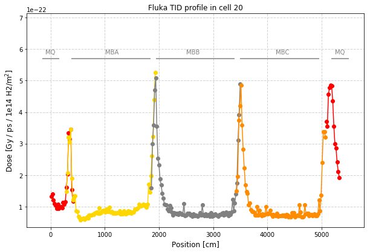


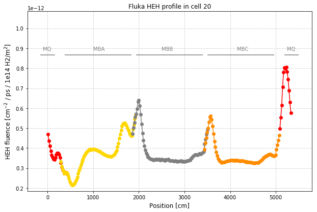


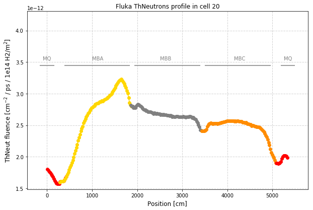


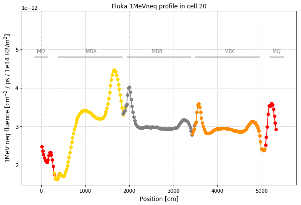


```python
xprime_full = dict()
radiation_full = dict()

for q in quantity :
    xprime_full[q] = []
    radiation_full[q] = []
    for f in filenum :
        for i in range(0,len(xprime[f][q])) :
            if (len(xprime_full[q])==0 or xprime[f][q][i] > xprime_full[q][len(xprime_full[q])-1]):
                #if len(xprime_full[q])>0 :
                #    print ('Debug: ' , xprime[f][q][i] , xprime_full[q][len(xprime_full)-1] , xprime_full[q])
                xprime_full[q].append(xprime[f][q][i])
                radiation_full[q].append(radiation_cut[f][q][i])
    #print ('Xprime full ' , q , ' with length' , len(xprime_full[q]) , ': ' , xprime_full[q])
    #print ('Radiation full ' , q , ' with length' , len(radiation_full[q]) , ': ' , radiation_full[q])

radiation_sym = dict()

def takeClosest(myList, myNumber):
    """
    Assumes myList is sorted. Returns closest value to myNumber.
    If two numbers are equally close, return the smallest number.
    """
    pos = bisect_left(myList, myNumber)
    if pos == 0:
        return myList[0]
    if pos == len(myList):
        return myList[-1]
    before = myList[pos - 1]
    after = myList[pos]
    if after - myNumber < myNumber - before:
       return after
    else:
       return before

for q in quantity :
    radiation_sym[q] = []
    for i in range(0,len(xprime_full[q])) :
        symmetric_x = halfcellmax - xprime_full[q][i]
        if symmetric_x in xprime_full[q] : # symmetric element "exactly" found
            i_sym = xprime_full[q].index(symmetric_x)
            radiation_sym[q].append(radiation_full[q][i]+radiation_full[q][i_sym])
            #print ('Test: ' , xprime_full[q][i] , symmetric_x , xprime_full[q][i_sym])
        else : # look for closest x position
            closest = takeClosest(xprime_full[q], symmetric_x)
            i_sym = xprime_full[q].index(closest)
            radiation_sym[q].append(radiation_full[q][i]+radiation_full[q][i_sym])
            #print ('Test: ' , xprime_full[q][i] , symmetric_x ,  closest , xprime_full[q][i_sym])
```


```python
fig2 = dict()
ax2 = dict()

for q in quantity :
    fig2[q] = plt.figure(facecolor = 'white',figsize=(10,6.5))
    ax2[q] = fig2[q].add_subplot(1,1,1)
    #ax2 = ax.twinx()
    ax2[q].set_title('ARC '+q+' profile from both beams')

    ax2[q].plot(xprime_full[q],radiation_sym[q],color='blue',label='Symmetrised radiation profile',marker='o')

    #if q=="TID" :
    #    ax[q].plot(BLMdata_b1b2_x,BLMdata_b1b2_dose,color='black',label='BLM data',marker='o')

    ax2[q].set_ylabel(yax[q]+'/ ps / 1e14 H2/m$^2$]',fontsize = 12)        
    ax2[q].set_xlabel('Position [cm]', fontsize = 12)
    ax2[q].set_ylim(top=ax2[q].get_ylim()[1]*1.3)
    
    #ax[q].legend(loc=(0.66, 0.85), prop = {'size':12}, numpoints = 1, ncol=2)

    #plt.xticks(np.arange(0.,7000., step=1000))
    ax2[q].grid(color='lightgray', linestyle='--', linewidth=1,axis='x')
    ax2[q].grid(color='lightgray', linestyle='--', linewidth=1,axis='y')
    
    
    for i in range(0,len(magnets_label)) :
        ax2[q].hlines(y=0.8*float(ax2[q].get_ylim()[1]), xmin=magnets_xmin[i], xmax=magnets_xmax[i],color='gray')
        plt.text(magnets_label_x[i],0.82*float(ax2[q].get_ylim()[1]),magnets_label[i],color='gray')


```


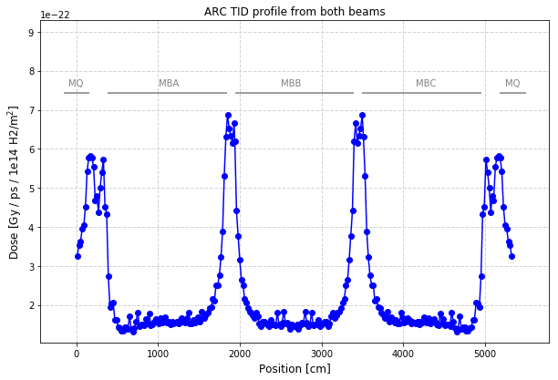


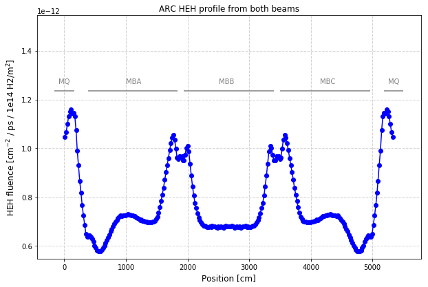


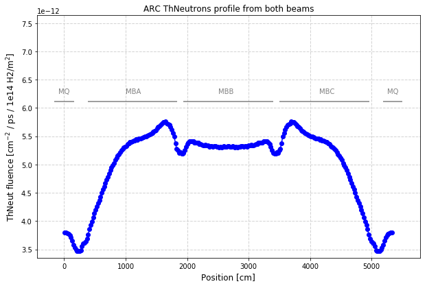


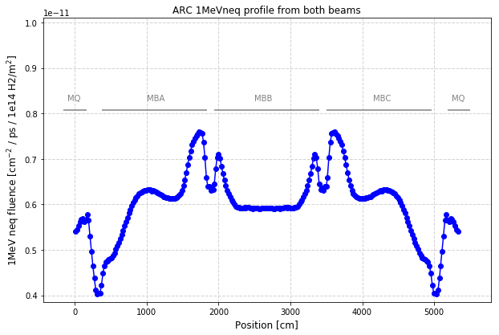


```python
ratios = ["HEHtoTID","1MeVneqtoTID","ThNeutronstoHEH"] # each element contains num,den
radiation_ratios = dict()

#for f in filenum :
#    radiation_ratios[f] = dict()
for rat in ratios :
    radiation_ratios[rat] = []
    pos = rat.find('to')
    #print (pos , rat[pos+2:])
    num = rat[0:pos]
    den = rat[pos+2:]
    for i in range(0,len(radiation_sym[num])) :
        radiation_ratios[rat].append(radiation_sym[num][i]/radiation_sym[den][i])
```


```python
figratio = dict()
axratio = dict()

for rat in ratios :
    
    pos = rat.find('to')
    #print (pos , rat[pos+2:])
    num = rat[0:pos]
    den = rat[pos+2:]
    
    figratio[rat] = plt.figure(facecolor = 'white',figsize=(10,6.5))
    axratio[rat] = figratio[rat].add_subplot(1,1,1)
    axratio[rat].set_title('Fluka '+num+' / '+den+' ratio in cell 20')
    #for f in filenum :
    axratio[rat].plot(xprime_full[num],radiation_ratios[rat],color='blue',label='Ratio of symmetrised radiation profiles',marker='o')

    extralabel = ""
    if den=="TID" :
        extralabel = " [cm$^{-2}$ / Gy]"
    axratio[rat].set_ylabel(num+' / '+den+' ratio'+extralabel,fontsize = 12)        
    axratio[rat].set_xlabel('Position [cm]', fontsize = 12)
    axratio[rat].set_ylim(top=axratio[rat].get_ylim()[1]*1.3)
    
    axratio[rat].grid(color='lightgray', linestyle='--', linewidth=1,axis='x')
    axratio[rat].grid(color='lightgray', linestyle='--', linewidth=1,axis='y')
    
    for i in range(0,len(magnets_label)) :
        axratio[rat].hlines(y=0.8*float(axratio[rat].get_ylim()[1]), xmin=magnets_xmin[i], xmax=magnets_xmax[i],color='gray')
        plt.text(magnets_label_x[i],0.82*float(axratio[rat].get_ylim()[1]),magnets_label[i],color='gray')


```


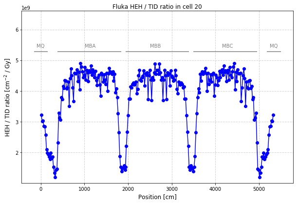


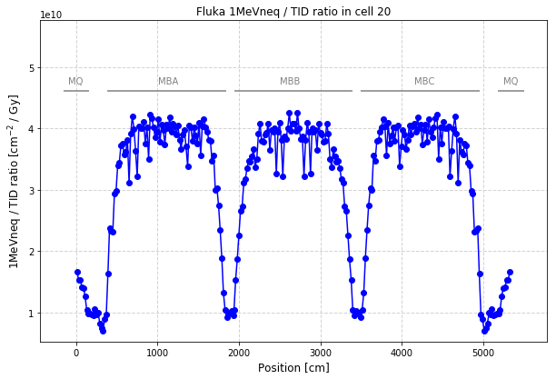


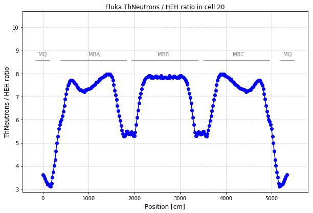


```python
intensity2016 = 1.3e21 # ps (per beam)
vacuum2016 = 4.3e12 # H2 / m3 

mycolor2=dict()
mycolor2["TID"] = 'red'
mycolor2["HEH"] = 'blue'
mycolor2["ThNeutrons"] = 'green'
mycolor2["1MeVneq"] = 'gold'

mylabel=dict()
mylabel["TID"] = 'TID'
mylabel["HEH"] = 'HEH fluence'
mylabel["ThNeutrons"] = 'ThNeut fluence'
mylabel["1MeVneq"] = '1MeV neq fluence'

# derive normalisation from BLMs
def quad(x,a,b):
    if len(a)!=len(b):
        print ("ERROR! Wrong lengths")
        return -1
    q=0
    for i in range(0,len(a)) :
        q += (x*a[i]-b[i])**2
    return q

x = np.arange(10, 40, 0.1)

def myq(x) :
    return quad(x,[0.001*x for x in BLMdata_b1b2_dose2016],[intensity2016*x for x in BLMdata_b1b2_doseFluka])
minimum = fmin(myq,10)[0]
#plt.plot(x,quad(x,[0.001*x for x in BLMdata_b1b2_dose2016],[intensity2016*x for x in BLMdata_b1b2_doseFluka]))
plt.plot(x,myq(x))
scalefactor=1/minimum


# make plot for total 2016 intensity
fig2016 = plt.figure(facecolor = 'white',figsize=(10,6.5))
ax2016 = fig2016.add_subplot(1,1,1)
ax2016bis = ax2016.twinx()

for q in quantity :
    
    if q=="TID" :
        continue
    
    ax2016.plot(xprime_full[q],[scalefactor*intensity2016*x for x in radiation_sym[q]],color=mycolor2[q],label=q,marker='o')

ax2016.set_ylabel('Fluence [cm$^{-2}$]')        
ax2016.set_xlabel('Position [cm]', fontsize = 12)
#ax2016.set_yscale('log')
ax2016.set_ylim(ax2016.get_ylim()[0]/2,ax2016.get_ylim()[1]*1.4)

ax2016bis.plot(xprime_full["TID"],[scalefactor*intensity2016*x for x in radiation_sym["TID"]],color=mycolor2["TID"],label='TID below cryo',marker='o')
ax2016bis.plot(BLMdata_b1b2_x,[scalefactor*intensity2016*x for x in BLMdata_b1b2_doseFluka],color='black',label='BLM TID (Fluka)',marker='o')
ax2016bis.plot(BLMdata_b1b2_x,[0.001*x for x in BLMdata_b1b2_dose2016],color='gray',label='BLM TID (data)',marker='o')


ax2016bis.set_ylabel('Dose [Gy]')        
ax2016bis.set_xlabel('Position [cm]', fontsize = 12)
#ax2016bis.set_yscale('log')
ax2016bis.set_title('2016 radiation levels for a vacuum density of '+str('{:0.2e}'.format(1e14*scalefactor))+' H$_2$ / m$^3$')
ax2016bis.set_ylim(ax2016bis.get_ylim()[0]/2,ax2016bis.get_ylim()[1]*1.4)

ax2016.legend(loc=(0.05, 0.87), prop = {'size':12}, numpoints = 1, ncol=2, frameon=False)

ax2016bis.legend(loc=(0.48, 0.87), prop = {'size':12}, numpoints = 1, ncol=2, frameon=False)

for i in range(0,len(magnets_label)) :
    ax2016.hlines(y=0.8*float(ax2016.get_ylim()[1]), xmin=magnets_xmin[i], xmax=magnets_xmax[i],color='gray')
    ax2016.text(magnets_label_x[i],0.82*float(ax2016.get_ylim()[1]),magnets_label[i],color='gray')


    

```

    Optimization terminated successfully.
             Current function value: 0.389442
             Iterations: 21
             Function evaluations: 42


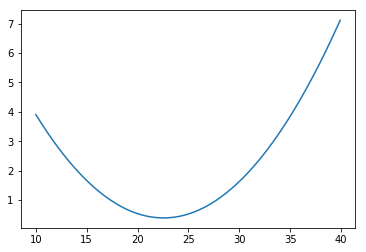


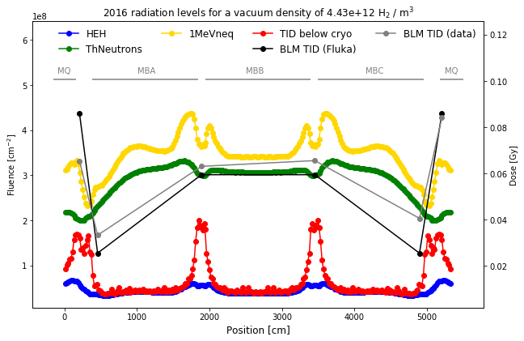


```python

```
